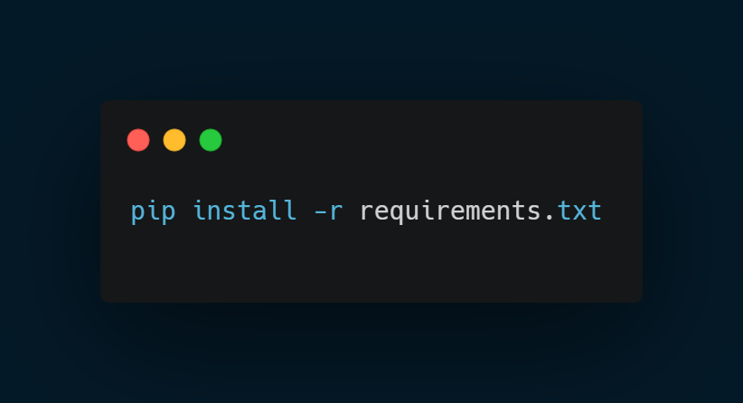

# PyPortScan

  

## 📚 PyPortScan: Port Scanning
PyPortScan is a port scanner tool developed in Python, created for the purpose of studying security analysis.
This project is currently in development and is perfect for those who want to better understand how port scanners work.

## 💻 Installation
To install the necessary libraries, execute the following command:

  

## 🚩Usage
The script is configured to scan all available ports. After the scan completes, all information is saved in an organized table in the scan_results.txt file.

## 💬 Contributions
Contributions are always welcome! Feel free to fork the repository, make your changes, and send a pull request.

🚨 **Note**: This project does not endorse or encourage malicious activities. The knowledge shared here is for defense and cybersecurity education purposes.
